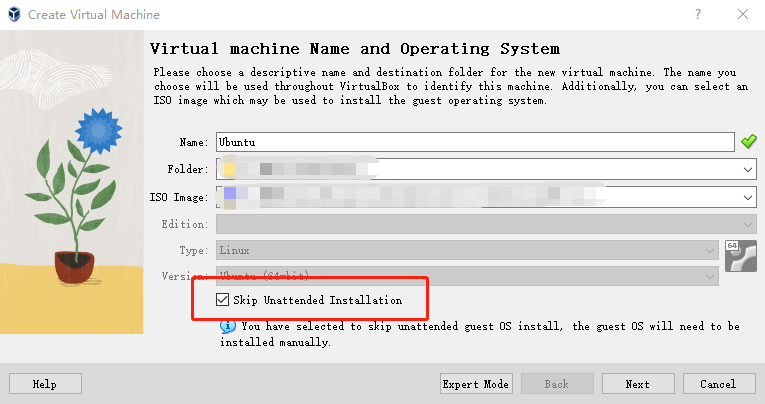

## KU EECS700 Lab

### Set up the environment

1. [Create Ubuntu VM from the .iso image](https://ubuntu.com/tutorials/how-to-run-ubuntu-desktop-on-a-virtual-machine-using-virtualbox#1-overview)
   - Install [Ubuntu 22.04.5 LTS (Jammy Jellyfish)](https://releases.ubuntu.com/22.04/)

   - Please ``Skip Unattended Installation``, otherwise your user cannot get root privilege

   - [**OPTIONAL**] ``Guest addition`` in VBox can help to use full screen, copy/paste and share files with the host, you can install it based on
     [Installing the Linux Guest Additions](https://www.virtualbox.org/manual/ch04.html#additions-linux) and [Setting up VirtualBox Guest Additions](https://help.ubuntu.com/community/VirtualBox/GuestAdditions)

  <p align="center">
    
  </p>

2. [Install VSCode](https://code.visualstudio.com/download)

3. Install `git` and `python3-venv`, otherwise the PlatformIO cannot run

    ```shell
    sudo apt-get -y update
    sudo apt-get install -y git python3-venv
    ```

4. [Install PlatformIO IDE for VSCode](https://platformio.org/install/ide?install=vscode)

5. Add the user into the group `dialout` to use ttyUSB0

    ```
    sudo usermod -aG dialout $USER
    ```

    If your host system is Linux, for USB devices to be available in VirtualBox, your user must be a member of the `vboxusers` group:
    ```shell
    sudo usermod -aG vboxusers $USER
    ```

6. For ease of transferring files out of Ubuntu VM to the host computer, a [shared folder](https://net2.com/how-to-share-folders-between-your-ubuntu-virtualbox-and-your-host-machine/) can be created.

### Reference

[IoT Security Hands-on Laboratory](https://cyber.cs.ucf.edu/iot/)

[PlatformIO IDE for VSCode](https://docs.platformio.org/en/latest/integration/ide/vscode.html)

[Get started with ESP-IDF and ESP32-DevKitC: debugging, unit testing, project analysis](https://docs.platformio.org/en/stable/tutorials/espressif32/espidf_debugging_unit_testing_analysis.html)

[Standard Toolchain Setup for Linux and macOS](https://docs.espressif.com/projects/esp-idf/en/stable/esp32/get-started/linux-macos-setup.html)
