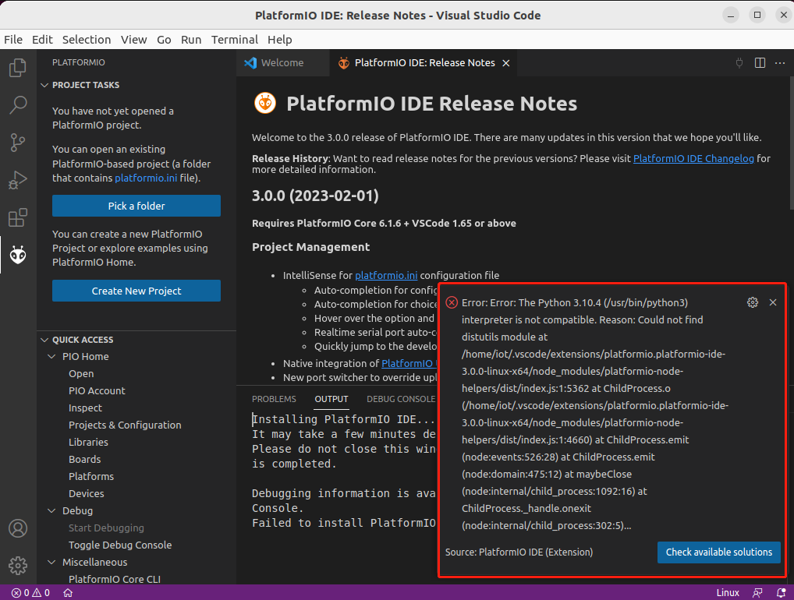

## Lab1: Read the humidity and temperature

An ESP32 development board is used to read data from the DHT22 humidity and temperature sensor, using [esp-idf-lib](https://github.com/UncleRus/esp-idf-lib).

### Set up the IoT kit

1. The diagram below shows how the DHT22 temperature and humidity sensor is connected to the ESP32:

    <p align="center">
    
    </p>


2. The pin layout is on the back of the ESP32 board：

    <p align="center">
    
    </p>

3. The picture below gives a closer look at the connections of the IoT kit:

    <p align="center">
    
    </p>

### Set up the environment

#### Install the CP210x USB to UART Bridge VCP Driver

1. **IMPORTANT**: Don't start the Ubuntu VM yet. You should install the USB driver and connect the ESP32 first. Only after doing this will you be able to find `/dev/ttyUSB0` in the Ubuntu VM.

2. Connect the ESP32 board to your computer via a micro USB cable.

3. Install the USB to UART bridge driver on the host computer, which will run the guest Ubuntu VM.
    - Windows

      Install [*the CP210x USB to UART Bridge VCP Drivers*](https://www.silabs.com/developers/usb-to-uart-bridge-vcp-drivers?tab=downloads) (CP210x Universal Windows Driver) for Windows. After installation, under *Ports* within the *Windows Device Manager*, you shall see *Silicon Labs CP210x USB to UART Bridge* (*COMx*), where *x* may be different at different computers.

    - macOS

      It appears macOS has the appropriate driver installed already. When the IoT kit is plugged in a USB port of a Mac computer, within Terminal, run ls /dev/*. /dev/cu.usbserial-0001 or similar shall be seen. When unplugged, the device disappears.
      - If there is no /dev/cu.usbserial-0001, please download and install [CP210x USB to UART Bridge VCP Drivers](https://www.silabs.com/developers/usb-to-uart-bridge-vcp-drivers) (CP210x VCP Mac OSX Driver).
      - Unzip the downloaded zip file. In the created macOS_VCP_Driver folder, run SiLabsUSBDriverDisk.dmg and then Install CP210x VCP Driver.app. After successful installation, within Terminal, run ls /dev/*. /dev/cu.SLAB_USBtoUART shall show up.

4. Go to `Devices -> USB -> USB settings` of VirtualBox, add `Silicon Labs CP2102 USB` to the `USB Device Filters` for USB devices to be available in VirtualBox.

  <p align="center">
    
  </p>

5. After log into the Ubuntu VM, within *Terminal*, run `ls /dev/ttyUSB0` to see ttyUSB0, when the mcro-usb cable of the IoT kit is unplugged from your host computer, ttyUSB0 disappears.

6. Add the user to the `dialout` group and adjust the permissions, otherwise, you'll encounter the error message: `Permission denied: /dev/ttyUSB0`

    ```shell
    sudo usermod -a -G dialout $USER

    sudo chmod 666 /dev/ttyUSB0
    ```

**Note**: It appears that the CP210x USB to UART Bridge VCP Driver has quite some issues. Here are troubleshooting tips
- Make sure the correct micro usb cable is used. The micro usb is like the one used for phones for both data communication and power supply.
- Try different USB ports on the computer and see which one works.
- Sometimes, unplug and plug again the micro usb cable will address the issue.

#### Create the project

1. Clone [ESP-IDF Components library](https://github.com/UncleRus/esp-idf-lib), ESP-IDF-LIB will be downloaded into `~/esp-idf-lib`

    ```shell
    cd ~ && git clone https://github.com/UncleRus/esp-idf-lib.git
    ```

2. Launch VSCode, Click on ``PlatformIO`` logo on the side to launch PlatformIO

    <p align="center">
    
    </p>

3. Click on ``PlatformIO Home`` button on the bottom PlatformIO Toolbar

    <p align="center">
    
    </p>

4. Click on `New Project`, select `Espressif ESP32 Dev Module` as the development board, `Espidf` as the framework

    <p align="center">
    
    </p>

    <p align="center">
    
    </p>

    By default, the project is created in `~/Documents/PlatformIO/Projects`.

5. After the project is created, you need to wait until the the dependecies are downloaded and updated

    <p align="center">
    
    </p>

6. Copy [lab1.c](src/lab1.c) to PlatformIO `src` folder, set the variables `platform` and `monitor_speed` in `platformio.ini`

    ```
    [env:esp32dev]
    platform = espressif32@4.4.0
    board = esp32dev
    framework = espidf
    monitor_speed = 115200
    ```

    <p align="center">
    
    </p>

7. Set `EXTRA_COMPONENT_DIRS` option in the root `CMakeLists.txt` file to Use ESP-IDF

    ```
    list(APPEND EXTRA_COMPONENT_DIRS ~/esp-idf-lib/components)
    ```

    <p align="center">
    
    </p>

8. To `build`, `upload`, and `monitor` the project, you can use one of two methods below. First, `build` the project. Next, `upload` the firmware to the ESP32 board. Finally, open the Serial Monitor to `monitor` the output from the ESP32.

    - `Build/Upload/Monitor` option from the `Project Tasks` menu
    <p align="center">
      
    </p>

    - `Build/Upload/Monitor` button in PlatformIO Toolbar
    <p align="center">
      
    </p>

   - **Note**: During the uploading process, you may need to **hold down the boot button until the uploading starts**, BOOT (IO0) button is on the right side(Chip on the top side) of ESP32

### Trouble Shooting

- If you can't change to the root user in VBox, or if it says `xxx is not in the sudoers file. This incident will be reported,` try `su root` or `sudo su`, the password is the same password you set during the installation

- If the VBox screen turns black and you cannot wake it up, you can choose from the menu: `View -> Virtual Screen 1 -> Resize to **_ x _**` (choose one you like), and then VBox will wake up

- If you encounter the error message, `pio\libdeps\esp32dev\DHT sensor library\DHT_U.h:36:29: fatal error: Adafruit_Sensor.h: No such file or directory`, add the following include statements to [lab1.c](src/lab1.c):
    ```shell
    #include <Adafruit_Sensor.h>
    ```

- If you encounter the error message, `The Python interpreter is not compatible. Reason: Could not find distutils module at ...,` please run:
    ```shell
    sudo apt-get install python3-venv
    ```
    <p align="center">
    
    </p>

- During connecting to `/dev/ttyUSB0`, may need to **hold the BOOT (IO0) button of the ESP32 until uploading starts**

- If you encounter the error message Permission denied: `/dev/ttyUSB0`, make sure to add the user to the `dialout` group and adjust the permissions:

    ```shell
    sudo usermod -a -G dialout $USER

    sudo chmod 666 /dev/ttyUSB0
    ```

- If you receive unreadable output from the monitor, make sure to set `monitor_speed = 115200` in `platformio.ini` file

- Press reset if no output from the serial port. If still doesn't work, unplug and re-plug the kit, or change a USB port since different USB ports may provide different power supplies


### Reference

[IoT Security Hands-on Laboratory](https://cyber.cs.ucf.edu/iot/)

[ESP32 via VS Code and PlatformIO](https://github.com/xinwenfu/tst-dht-lab)

[PlatformIO IDE for VSCode](https://docs.platformio.org/en/latest/integration/ide/vscode.html)

[Get started with ESP-IDF and ESP32-DevKitC: debugging, unit testing, project analysis](https://docs.platformio.org/en/stable/tutorials/espressif32/espidf_debugging_unit_testing_analysis.html)

[Standard Toolchain Setup for Linux and macOS](https://docs.espressif.com/projects/esp-idf/en/stable/esp32/get-started/linux-macos-setup.html)
