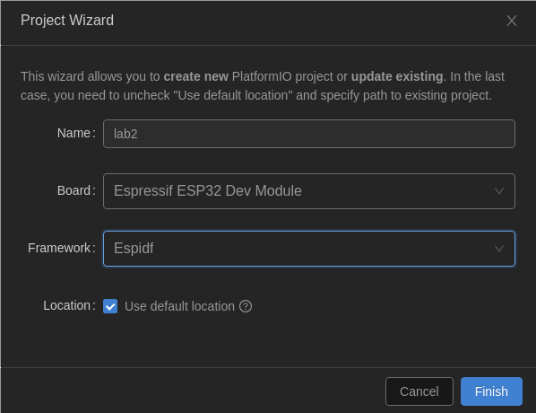

## Lab2: Obtain the WiFi credentials

There are three serial ports on the original ESP32. UART0 is often used for programming and communication with outside of ESP32 while the other two UART ports are unused. The Micro-USB connector of our IoT kit is connected to UART0 through a USB-UART bridge chip. If there is no protection of UART, a hacker can access the flash through UART.

The access to UART can be protected by a password. That is, a user must enter the correct password to upload firmware and communicate with the IoT kit. We can perform ethical hack of the IoT kit, try to obtain the WiFi credentials embedded in the firmware and even change the firmware.

### Set ESP-IDF environment

1. Install Prerequisites

```shell
sudo apt -y update
sudo apt -y install git wget flex bison gperf bless ghex nano xxd hexedit python3 python3-venv python3-pip cmake ninja-build ccache libffi-dev libssl-dev dfu-util libusb-1.0-0
```

2. Get ESP-IDF version 4.3, ESP-IDF will be downloaded into `~/esp-idf`
```shell
cd ~ && git clone -b v4.3 --recursive https://github.com/espressif/esp-idf.git
```

3. Set up the tools
```shell
cd ~/esp-idf && pip3 install virtualenv && ./install.sh esp32
```

4. Set up the environment variables
```shell
. ~/esp-idf/export.sh
```

5. Create an alias for executing export.sh, you can run `get_idf` to refresh the esp-idf environment in any terminal session

    - Copy and paste the following command to your shell’s profile `~/.bashrc`

        ```
        alias get_idf='. ~/esp-idf/export.sh'
        ```

    - Update `~.bashrc`

        ```
        source ~/.bashrc
        ```
### Hex editors

We use one of four methods to edit binary files: `bless`, `ghex`, [hexed.it](https://hexed.it/), or `xxd`. Bless and Ghex offer a GUI, while the others are introduced below.

- [hexed.it](https://hexed.it/)
  - Go to the [hexed.it](https://hexed.it/) website using your browser
  - Click on the ``Open file`` button or drag-and-drop a file into the editor window
  - Click on any byte in the hex view to select it, then start typing the new hex values you want to replace
  - Click on the ``Save as`` button to save to download the modified file

- xxd
  - Create a hex dump
      ```shell
      xxd filename.bin > temp.hex
      ```
  - Edit ``temp.hex`` with your preferred text editor
      ```shell
      # using vim
      vim temp.hex

      # using nano
      nano temp.hex
      ```
  - Convert the hex dump back to binary
      ```shell
      xxd -r temp.hex > filename.bin
      ```

### Create the project

1. Create the project, copy [lab2.c](src/lab2.c) to PlatformIO `src` folder, set the variables `platform` and `monitor_speed` in `platformio.ini`

    <p align="center">
    
    </p>

    ```shell
    [env:esp32dev]
    platform = espressif32@4.4.0
    board = esp32dev
    framework = espidf
    monitor_speed = 115200
    ```


2. Change the Wifi SSID and Password in the code [lab2.c](src/lab2.c)
    ```shell
    #define WIFI_SSID      "myssid"
    #define WIFI_PASS      "mypass"
    ```

<!-- 3. Retrieve partition table in the binary format: -->

<!--     ```shell -->
<!--     esptool.py read_flash 0x8000 0xc00 ptable.img -->
<!--     ``` -->

<!--     where 0x8000 is the start address of the partition table and 0xc00 is the length of the partition table. The binary partition table is saved in ptable.img. -->

<!--     **Note:** You may need to press the `IO0 button` on the chip to read or write to the flash. -->

<!--     The following command will print out the partition table of our IoT kit in the CSV (comma-separated values) format. The partition table shows how the flash is partitioned. -->
<!--     ```shell -->
<!--     gen_esp32part.py ptable.img -->
<!--     ``` -->

3. Retrieve firmware

    ```shell
    esptool.py read_flash 0 0x400000 flash_contents.bin
    ```

    where 0 is the starting address and 0x400000 is the length of the flash of the ESP32-WROOM-32 surface-mount module board that our IoT kit uses. The whole flash in the binary format is saved in flash_contents.bin.

    **Note:** You may need to press the `IO0 button` on the chip to read or write to the flash.


4. Change the firmware
    
    Use hex editors to view the firmware and search for the WiFi credentials in the flash dump. The changed flash dump can be flash back to the IoT kit. Another firmware may be written. esptool.py can be used to write the changed firmware back to the ESP32.

    ```shell
    esptool.py write_flash 0 flash_contents_good.bin
    ```

    **Note:** You may need to press the `IO0 button` on the chip to read or write to the flash.

### Example Output

Note that the output, in particular the order of the output, may vary depending on the environment.

Console output if station connects to AP successfully:

```
I (589) wifi station: ESP_WIFI_MODE_STA
I (599) wifi: wifi driver task: 3ffc08b4, prio:23, stack:3584, core=0
I (599) system_api: Base MAC address is not set, read default base MAC address from BLK0 of EFUSE
I (599) system_api: Base MAC address is not set, read default base MAC address from BLK0 of EFUSE
I (629) wifi: wifi firmware version: 2d94f02
I (629) wifi: config NVS flash: enabled
I (629) wifi: config nano formating: disabled
I (629) wifi: Init dynamic tx buffer num: 32
I (629) wifi: Init data frame dynamic rx buffer num: 32
I (639) wifi: Init management frame dynamic rx buffer num: 32
I (639) wifi: Init management short buffer num: 32
I (649) wifi: Init static rx buffer size: 1600
I (649) wifi: Init static rx buffer num: 10
I (659) wifi: Init dynamic rx buffer num: 32
I (759) phy: phy_version: 4180, cb3948e, Sep 12 2019, 16:39:13, 0, 0
I (769) wifi: mode : sta (30:ae:a4:d9:bc:c4)
I (769) wifi station: wifi_init_sta finished.
I (889) wifi: new:<6,0>, old:<1,0>, ap:<255,255>, sta:<6,0>, prof:1
I (889) wifi: state: init -> auth (b0)
I (899) wifi: state: auth -> assoc (0)
I (909) wifi: state: assoc -> run (10)
I (939) wifi: connected with #!/bin/test, aid = 1, channel 6, BW20, bssid = ac:9e:17:7e:31:40
I (939) wifi: security type: 3, phy: bgn, rssi: -68
I (949) wifi: pm start, type: 1

I (1029) wifi: AP's beacon interval = 102400 us, DTIM period = 3
I (2089) esp_netif_handlers: sta ip: 192.168.77.89, mask: 255.255.255.0, gw: 192.168.77.1
I (2089) wifi station: got ip:192.168.77.89
I (2089) wifi station: connected to ap SSID:myssid password:mypassword
```

Console output if the station failed to connect to AP:

```
I (589) wifi station: ESP_WIFI_MODE_STA
I (599) wifi: wifi driver task: 3ffc08b4, prio:23, stack:3584, core=0
I (599) system_api: Base MAC address is not set, read default base MAC address from BLK0 of EFUSE
I (599) system_api: Base MAC address is not set, read default base MAC address from BLK0 of EFUSE
I (629) wifi: wifi firmware version: 2d94f02
I (629) wifi: config NVS flash: enabled
I (629) wifi: config nano formating: disabled
I (629) wifi: Init dynamic tx buffer num: 32
I (629) wifi: Init data frame dynamic rx buffer num: 32
I (639) wifi: Init management frame dynamic rx buffer num: 32
I (639) wifi: Init management short buffer num: 32
I (649) wifi: Init static rx buffer size: 1600
I (649) wifi: Init static rx buffer num: 10
I (659) wifi: Init dynamic rx buffer num: 32
I (759) phy: phy_version: 4180, cb3948e, Sep 12 2019, 16:39:13, 0, 0
I (759) wifi: mode : sta (30:ae:a4:d9:bc:c4)
I (769) wifi station: wifi_init_sta finished.
I (889) wifi: new:<6,0>, old:<1,0>, ap:<255,255>, sta:<6,0>, prof:1
I (889) wifi: state: init -> auth (b0)
I (1889) wifi: state: auth -> init (200)
I (1889) wifi: new:<6,0>, old:<6,0>, ap:<255,255>, sta:<6,0>, prof:1
I (1889) wifi station: retry to connect to the AP
I (1899) wifi station: connect to the AP fail
I (3949) wifi station: retry to connect to the AP
I (3949) wifi station: connect to the AP fail
I (4069) wifi: new:<6,0>, old:<6,0>, ap:<255,255>, sta:<6,0>, prof:1
I (4069) wifi: state: init -> auth (b0)
I (5069) wifi: state: auth -> init (200)
I (5069) wifi: new:<6,0>, old:<6,0>, ap:<255,255>, sta:<6,0>, prof:1
I (5069) wifi station: retry to connect to the AP
I (5069) wifi station: connect to the AP fail
I (7129) wifi station: retry to connect to the AP
I (7129) wifi station: connect to the AP fail
I (7249) wifi: new:<6,0>, old:<6,0>, ap:<255,255>, sta:<6,0>, prof:1
I (7249) wifi: state: init -> auth (b0)
I (8249) wifi: state: auth -> init (200)
I (8249) wifi: new:<6,0>, old:<6,0>, ap:<255,255>, sta:<6,0>, prof:1
I (8249) wifi station: retry to connect to the AP
I (8249) wifi station: connect to the AP fail
I (10299) wifi station: connect to the AP fail
I (10299) wifi station: Failed to connect to SSID:myssid, password:mypassword
```

### Trouble Shooting
1. To monitor the serial output, you need to press the `EN button` after uploading the data.

2. To read and write flash, you need to press the `IO0 button`.

### Reference

[ESP32 UART and Flash Hack](https://github.com/xinwenfu/ESP32-UART-and-Flash-Hack)

[Wi-Fi Station Example](https://github.com/espressif/esp-idf/tree/master/examples/wifi/getting_started/station)
