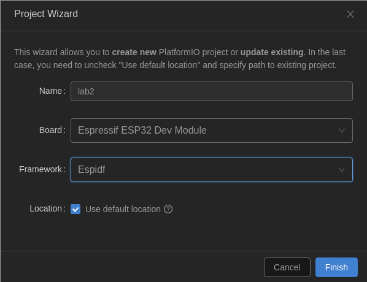

## Lab3: Basic OTA via WiFi on ESP32

This project demonstrates how to use the Over The Air (OTA) update system on an ESP32 board. It also shows the danger of OTA updates without security. If security is not considered for the OTA update system, an adversary may inject malicious firmware into a victim device through an OTA update.

### Create the project

1. Create the _Arduino_ project, copy [lab3.cpp](src/lab3.cpp) to PlatformIO `src` folder, set the variables `platform`, `framework` and `monitor_speed` in `platformio.ini`.

   <p align="center">
   
   </p>

   ```shell
    [env:esp32dev]
    platform = espressif32@4.4.0
    board = esp32dev
    framework = arduino
    monitor_speed = 115200
   ```

2. Change the Wifi SSID and Password in the code [lab3.cpp](src/lab3.cpp).
   ```shell
   #define WIFI_SSID      "myssid"
   #define WIFI_PASS      "mypass"
   ```

### Flashing the board for the first time via micro USB

1. Build the project.

2. Upload the firmware via micro USB, the first installation of the firmware will need to be over the micro USB cable.

   - The code that is built contains OTA functionality and once flashed into the ESP32 board will be running and waiting for later OTA requests.
   - Press and hold the BOOT button (IO0) of the ESP32 board until the upload starts, in some cases this may not be needed.

3. The newly uploaded firmware blinks the blue LED on the board at a regular interval. The ESP32 board is ready for upgrading through OTA if the blue LED on the board blinks.

4. Use the Serial Monitor to see the output from the ESP board firmware, which prints out the IP address of the board.

### OTA via WiFi

1. Change the code, e.g, the frequency of the LED light blinking. In the code snippet below, the _delay_ function controls the frequency of the blinking.

   ```shell
   digitalWrite(LED_BUILTIN, HIGH);   // turn the LED on (HIGH is the voltage level)
   delay(500);                       // wait for a second
   digitalWrite(LED_BUILTIN, LOW);    // turn the LED off by making the voltage LOW
   delay(500);                       // wait for a second
   ```

2. Build the project, the firmware binary file will be located in the `.pio/build/esp32dev/` directory within your VSCode project, named `firmware.bin`.

3. Ensure that both your computer and the ESP device are connected to the **same network**.

4. Upload the firmware via OTA using the `espota.py` tool. When you update the `platformio.ini` file, PlatformIO will automatically download any required tools, the default path is `~/.platformio`.

   ```shell
   python3 ~/.platformio/packages/framework-arduinoespressif32/tools/espota.py -d -i [YOUR-ESP-IP] -f .pio/build/esp32dev/firmware.bin
   ```

   **Note:** This will fail if you have a firewall blocking packets, not in the same network or VirtualBox are not using a bridged network adapter!

5. Notice the different uploading process when compared to the uploading process via micro USB.

### Trouble Shooting

1. To monitor the serial output, you need to press the `EN button` after uploading the data.

2. To read and write flash, you need to press the `IO0 button`.

### Reference

[ESP32 UART and Flash Hack](https://github.com/xinwenfu/ESP32-UART-and-Flash-Hack)

[Wi-Fi Station Example](https://github.com/espressif/esp-idf/tree/master/examples/wifi/getting_started/station)
